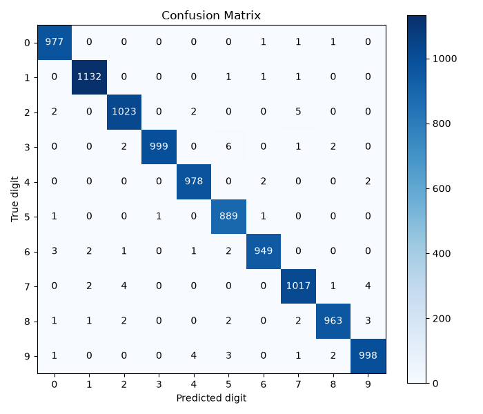
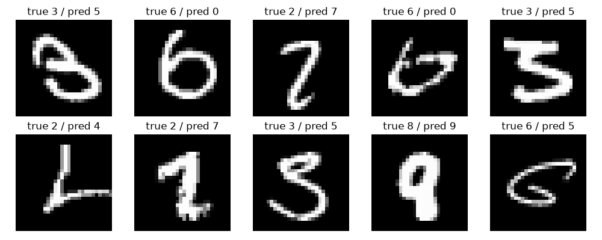

# Machine Learning: Model and Training

This section describes the machine learning part of the project: how the
digit recognition model was built, trained and evaluated.

## Problem

The goal is to recognize a single handwritten digit (0-9) from an image.
This is a supervised image classification problem: given a picture of a
digit, the model outputs which of the ten digits it thinks it is.

## Dataset

We used the **MNIST** dataset, a standard benchmark for handwritten digit
recognition. It contains:

- 60,000 training images
- 10,000 test images

Each image is 28x28 pixels, grayscale, and shows one centered digit. The
dataset is well balanced, with roughly 6,000 training examples per digit.

## Preprocessing

Before training, each image is prepared as follows:

- Pixel values are scaled from the original `0-255` range to `[0, 1]`.
- A channel dimension is added so each image has shape `(28, 28, 1)`, which
  is the format a convolutional network expects.

The same preprocessing is reused at prediction time through a shared
`prepare_image()` helper, so images coming from the web application are
converted to the exact format the model was trained on (28x28, grayscale,
normalized, white digit on a black background).

## Model architecture

We used a small Convolutional Neural Network (CNN). CNNs work well for
images because they learn local patterns such as edges and strokes. The
architecture is:

| Layer | Details |
|-------|---------|
| Conv2D | 32 filters, 3x3, ReLU |
| MaxPooling2D | 2x2 |
| Conv2D | 64 filters, 3x3, ReLU |
| MaxPooling2D | 2x2 |
| Flatten | - |
| Dense | 128 units, ReLU |
| Dropout | rate 0.5 |
| Dense | 10 units, softmax |

The two convolution blocks extract features from the image, and the dense
layers act as the classifier. Dropout is used before the final layer to
reduce overfitting. The final softmax layer outputs a probability for each
of the ten digits. In total the model has about 225,000 parameters, which
is small enough to train quickly even on a CPU.

## Training setup

- **Optimizer:** Adam
- **Loss:** sparse categorical crossentropy (labels are integers 0-9)
- **Epochs:** 10
- **Batch size:** 128
- **Validation split:** 10% of the training data

The model was trained on the 60,000 training images and validated on a
held-out 10% during training to watch for overfitting.

## Results

The model reaches **99.25% accuracy** on the 10,000 test images that were
never seen during training. The training, validation and test accuracies
are all very close, which shows the model generalizes well and is not
overfitting.

Accuracy per digit is consistently high (every digit is above 98.8%):

| Digit | Accuracy | Digit | Accuracy |
|-------|----------|-------|----------|
| 0 | 99.69% | 5 | 99.66% |
| 1 | 99.74% | 6 | 99.06% |
| 2 | 99.13% | 7 | 98.93% |
| 3 | 98.91% | 8 | 98.87% |
| 4 | 99.59% | 9 | 98.91% |

The confusion matrix below shows a strong diagonal, meaning almost all
digits are classified correctly, with only a few off-diagonal mistakes.



Looking at the few misclassified examples, most errors are on digits that
are genuinely hard to read or ambiguously written.



## How to reproduce

From the project root:

```bash
pip install -r requirements.txt
python -m ml.train        # trains the model and saves models/mnist_cnn.keras
python -m ml.evaluate     # prints accuracy and regenerates the figures
```

The trained model is also committed at `models/mnist_cnn.keras` so the
backend can load it directly without retraining.
